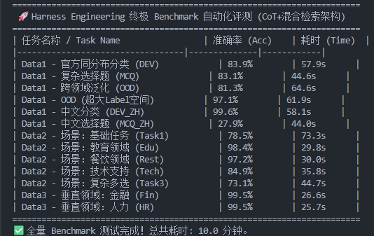

<h1 align="center">Context-Budgeted LLM Harness for Robust Classification</h1>

<h3 align="center">Dynamic retrieval, task routing, and structured output control around a frozen LLM</h3>

<p align="center">
  <a href="README.md">English</a> | <a href="README.zh-CN.md">中文</a>
</p>

<p align="center">
  LLM harness · Context engineering · Dynamic retrieval · Robust parsing · OOD evaluation
</p>

---

This repository implements a compact LLM harness for classification-style tasks under a strict prompt budget. Given a stream of labeled examples, the harness builds an external memory, retrieves task-relevant demonstrations, routes between intent classification and multiple-choice reasoning, constrains the model output format, and returns an exact-match label.

The project focuses on a practical systems question: when the base model is frozen, how much evaluation reliability can be gained from the surrounding control layer? The answer is studied through retrieval policy, prompt-budget management, runtime task routing, structured generation, deterministic parsing, and extended error analysis.

## Why This Project

Large language model applications are often limited not by the model call alone, but by the harness around the model: how context is selected, how prompts are assembled, how outputs are validated, and how failures are handled. This project isolates that layer in a small, auditable setting.

The setting is deliberately constrained:

- the model is used only through an OpenAI-compatible chat API;
- no model weights are updated;
- each prompt must fit within a fixed token budget;
- the final answer must exactly match one label from the observed label space;
- the same implementation must handle short intent queries, OOD label spaces, and natural-language multiple-choice questions.

These constraints make the project a concrete study of the inference-time control layer around a frozen LLM: the harness selects context, routes task formats, constrains the output schema, and maps generation back into a valid label space.

## System Design

The core implementation is `MyHarness` in `solution.py`.

1. **External memory**
   The harness receives labeled examples through `update(text, label)` and stores them as a lightweight memory bank.

2. **Hybrid dynamic retrieval**
   For each test input, the harness computes a similarity score between the query and every stored example. The feature set combines word-level tokens with character 3-grams, which improves tolerance to short texts, abbreviations, and noisy surface forms.

3. **Runtime task routing**
   The harness inspects the current label space. Short option-like labels trigger a multiple-choice prompt; otherwise the system uses an intent-classification prompt. This keeps the same code path usable across heterogeneous task formats.

4. **Token-budgeted prompt assembly**
   Retrieved examples are added as few-shot demonstrations only while the prompt remains within the configured token budget. Lower-ranked examples are removed first to avoid uncontrolled truncation.

5. **Structured output and fallback parsing**
   The model is asked to emit a compact XML-like response containing a final `<label>`. The parser then applies exact match, cleaned match, substring match, and nearest-neighbor fallback so that `predict()` remains robust to minor output-format drift.

## Results

On the local DEV split, the harness reaches approximately 83% accuracy with Qwen3-8B in non-thinking mode. The extended benchmark further evaluates same-distribution classification, OOD labels, multiple-choice tasks, bilingual inputs, and selected vertical domains, providing robustness observations and error-analysis material across task formats.



The main empirical observations are:

- hybrid word + 3-gram retrieval is more stable than purely lexical matching on short and noisy inputs;
- prompt-budget control prevents long examples from silently damaging later instructions through truncation;
- structured output constraints reduce exact-match failures caused by verbose LLM responses;
- error cases can be analyzed through label ambiguity, prompt interference, reasoning drift, and data-quality stress cases before drawing model-capability conclusions.

More detailed analysis is available in [docs/exploration_report.md](docs/exploration_report.md).

## Quick Start

Install dependencies:

```bash
pip install -r requirements.txt
```

Configure an OpenAI-compatible endpoint. Do not commit real credentials.

PowerShell:

```powershell
$env:LLM_BASE_URL="https://dashscope.aliyuncs.com/compatible-mode/v1"
$env:LLM_API_KEY="your-api-key"
$env:LLM_MODEL="qwen3-8b"
$env:LLM_ENABLE_THINKING="false"
```

Bash:

```bash
export LLM_BASE_URL="https://dashscope.aliyuncs.com/compatible-mode/v1"
export LLM_API_KEY="your-api-key"
export LLM_MODEL="qwen3-8b"
export LLM_ENABLE_THINKING="false"
```

Run the local evaluation:

```bash
python run.py --runs 1
```

Run the extended benchmark:

```bash
python scripts/benchmark.py
```

## Repository Structure

```text
.
├── solution.py                 # Core harness implementation
├── harness_base.py             # Minimal harness interface used by the evaluator
├── run.py                      # Local evaluation runner
├── llm_client.py               # OpenAI-compatible client configured by environment variables
├── requirements.txt
├── data/                       # Local DEV split
├── tokenizer/                  # Tokenizer used for prompt-budget accounting
├── mock-data/                  # Extended benchmark datasets
├── scripts/
│   └── benchmark.py            # Extended benchmark runner
├── docs/
│   └── exploration_report.md
└── assets/
    ├── benchmark-results.png
    └── benchmark-results-repeat.png
```

## Scope and Provenance

This project grew from a constrained harness-engineering evaluation setting. The repository keeps the original root-level evaluation entrypoints and local DEV assets so that the implementation remains directly runnable and comparable to the evaluated environment.

The project-specific work is concentrated in:

- `solution.py`: retrieval, task routing, prompt construction, output parsing, and fallback logic;
- `llm_client.py`: public-safe API configuration through environment variables;
- `scripts/benchmark.py`: extended robustness evaluation across additional datasets;
- `docs/` and this README: experiment organization and error analysis.

The repository keeps the benchmark origin and local DEV assets visible so that the implementation remains directly runnable and comparable to the original evaluation setting. The project contribution is a small, reproducible LLM harness for context-budgeted evaluation, dynamic task routing, structured output constraints, and error analysis.

## Notes on Safety

API keys and private application materials should not be committed. The client reads credentials from environment variables, and `.gitignore` excludes `.env` files and local private documents. If a real key has appeared in Git history, rotate it before publishing the repository.
